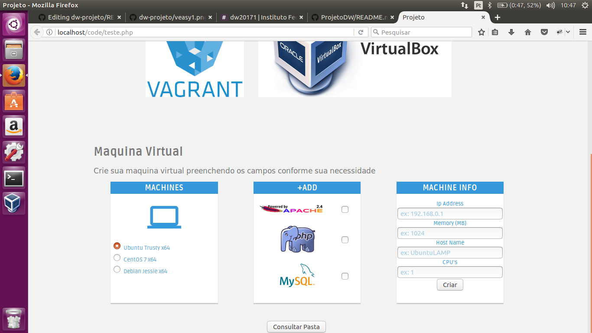

VirtualEasy

VirtualEasy é uma plataforma Web desenvolvida para facilitar a criação de maquinas virtuais.Para seu funcionamento é preciso fazer o download do Virtual-Box v5.0 e do Vagrantfile, ao informar os dados no site e clicar em criar, um arquivo Vagrantfile é gerado para que a maquina possa ser inicializada.

As informações como maquina virtual linux e softwares como apache2, bem como informaçoes da quantidade de memoria ram podem ser especificada nos campos abaixo

