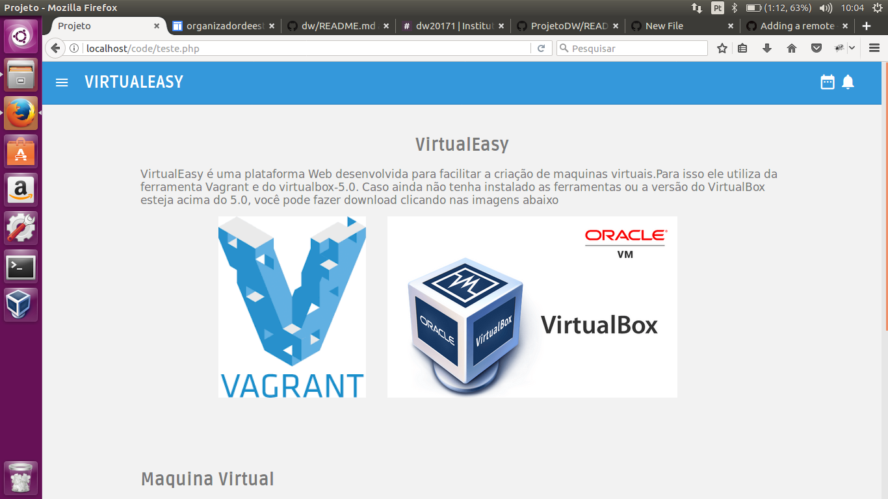

#VirtualEasy

VirtualEasy é uma plataforma Web desenvolvida para facilitar a criação de maquinas virtuais.

As informações como maquina virtual e softwares como apache2 bem como informaçoes como quantidade de memoria ram podem ser especificada nos campos abaixo

